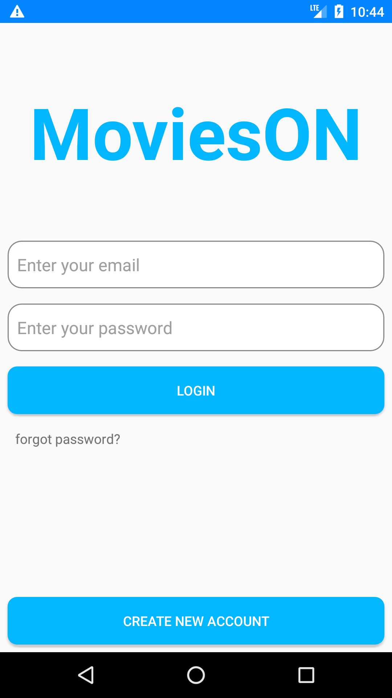
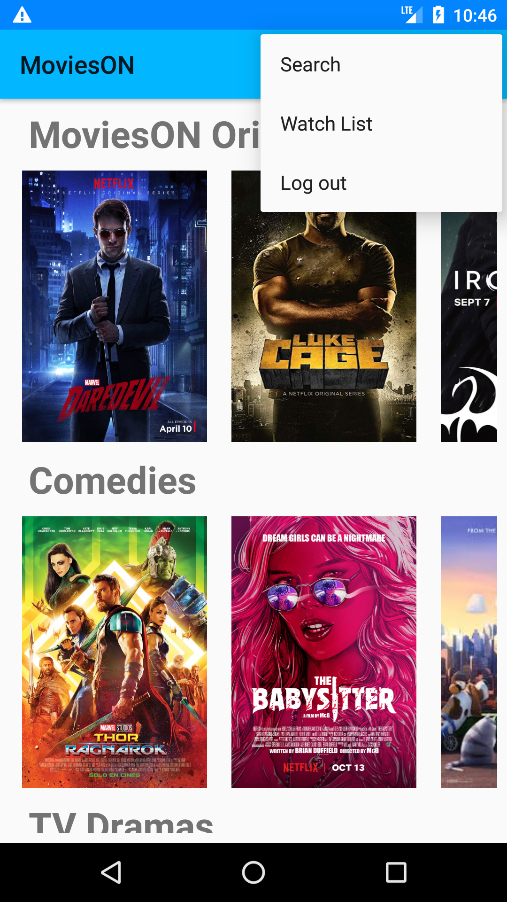

# MoviesON

* Developed as an Android application.
* Architected using Java, Google’s Firebase and SQLite.
* Allows user to authenticate, watch, search, and save movies.

## Screenshots

### Loading Screen : 

### Login: 

### Home: 

